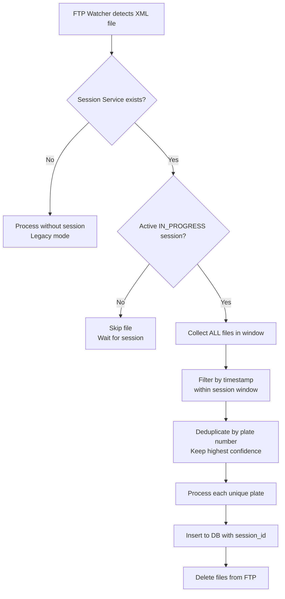

# Session-Based ANPR Processing

## Overview

ANPR listener sekarang menggunakan **session-based processing** yang hanya memproses data ketika ada session aktif dengan status `IN_PROGRESS`. Sistem ini mengumpulkan semua file ANPR dalam time window tertentu (default 20 detik) dan melakukan deduplikasi berdasarkan plate number dengan confidence tertinggi.

## How It Works

### 1. Session Lifecycle

```
START (Hasura) → IN_PROGRESS (Hasura) → [20 sec window] → COMPLETED (Hasura)
```

- **STARTED**: Session dibuat via Hasura GraphQL mutation
- **IN_PROGRESS**: Status diubah ke IN_PROGRESS via Hasura agar ANPR mulai memproses
- **Window**: Dari `started_at` sampai `started_at + SESSION_WINDOW_SECONDS`
- **COMPLETED**: Session di-complete manual via Hasura (tidak auto-complete)

### 2. ANPR Processing Flow



### 3. Data Collection Window

**Time Window**: `started_at` hingga `started_at + SESSION_WINDOW_SECONDS`

```
Session Start: 08:00:00
Window: 20 seconds
Window End: 08:00:20

Files processed:
✅ file1.xml - captured_at: 08:00:02
✅ file2.xml - captured_at: 08:00:10
✅ file3.xml - captured_at: 08:00:18
❌ file4.xml - captured_at: 08:00:25 (outside window)
```

### 4. Deduplication Logic

Jika ada multiple captures untuk plate number yang sama:
- **Kept**: Entry dengan `confidence` tertinggi
- **Discarded**: Entry lainnya

**Example:**

| File | Plate | Confidence | Status |
|------|-------|------------|--------|
| file1.xml | B1234CD | 0.85 | ❌ Discarded |
| file2.xml | B1234CD | 0.92 | ✅ **Kept** (highest) |
| file3.xml | B1234CD | 0.78 | ❌ Discarded |
| file4.xml | B5678EF | 0.88 | ✅ Kept (unique) |

Result: 2 unique plates inserted to database

## Configuration

### Environment Variables

```bash
# .env file
SESSION_WINDOW_SECONDS=20  # Time window in seconds
```

### Database Schema

Session table sudah include kolom:
- `started_at`: Session mulai
- `ended_at`: Session selesai (di-set via Hasura saat complete)
- `status`: STARTED, IN_PROGRESS, COMPLETED, CANCELLED, ERROR

ANPR table include:
- `session_id`: Foreign key to `transact_wim_session.id`

**Note**: Session management (create, update status, complete) dilakukan via **Hasura GraphQL**, bukan REST API.

## Hasura Integration

### Step 1: Start Session (via Hasura)

Frontend calls Hasura GraphQL mutation:

```graphql
mutation CreateSession {
  insert_transact_wim_session_one(object: {
    site_id: "uuid-of-site"
    session_name: "Morning Session"
    status: "STARTED"
    notes: "Shift pagi"
  }) {
    id
    code
    started_at
    status
  }
}
```

**Response:**
```json
{
  "data": {
    "insert_transact_wim_session_one": {
      "id": "550e8400-e29b-41d4-a716-446655440000",
      "code": "WIM-2025-0001",
      "started_at": "2025-01-03T08:00:00+07:00",
      "status": "STARTED"
    }
  }
}
```

### Step 2: Update Status to IN_PROGRESS (via Hasura)

**IMPORTANT**: Session harus diubah ke `IN_PROGRESS` agar ANPR listener mulai memproses!

```graphql
mutation StartSession($id: uuid!) {
  update_transact_wim_session_by_pk(
    pk_columns: { id: $id }
    _set: { status: "IN_PROGRESS" }
  ) {
    id
    code
    status
    started_at
  }
}
```

**Variables:**
```json
{
  "id": "550e8400-e29b-41d4-a716-446655440000"
}
```

### Step 3: ANPR Automatically Processes

ANPR listener akan:
1. ✅ Detect active IN_PROGRESS session
2. ✅ Collect all files in 20-second window
3. ✅ Deduplicate by plate number
4. ✅ Insert to database with `session_id`

**Note**: Backend **TIDAK** auto-complete session. Frontend harus trigger complete via Hasura.

### Step 4: Complete Session (via Hasura)

Frontend completes session when done:

```graphql
mutation CompleteSession($id: uuid!) {
  update_transact_wim_session_by_pk(
    pk_columns: { id: $id }
    _set: {
      status: "COMPLETED"
      ended_at: "now()"
    }
  ) {
    id
    code
    status
    started_at
    ended_at
  }
}
```

## Logging

### ANPR Listener Logs

```log
[ANPR] Active session found: WIM-2025-0001 (Window: 20s)
[ANPR_BATCH] Collecting files from session window: 2025-01-03T08:00:00Z to 2025-01-03T08:00:20Z
[ANPR_BATCH] Collected: file1.xml (plate=B1234CD, conf=0.85)
[ANPR_BATCH] Collected: file2.xml (plate=B1234CD, conf=0.92)
[ANPR_BATCH] Collected: file3.xml (plate=B5678EF, conf=0.88)
[ANPR_BATCH] Total files collected in window: 3
[ANPR_BATCH] Duplicate plate B1234CD: replacing conf=0.85 with conf=0.92
[ANPR_BATCH] After deduplication: 2 unique plates
[ANPR_BATCH] Processing plate: B1234CD (conf=0.92)
[ANPR_BATCH] Processing plate: B5678EF (conf=0.88)
[ANPR_BATCH] Session WIM-2025-0001: Processed 2 unique plates
```

### Backend Logs

Backend service hanya membaca session status, tidak melakukan auto-complete:

```log
[ANPR] Session-based processing enabled (window: 20 seconds)
[ANPR] Active session found: WIM-2025-0001 (Window: 20s)
```

## Query Examples

### Get all ANPR data for a session

```sql
SELECT
    a.plate_no,
    a.confidence,
    a.captured_at,
    a.minio_full_image_object,
    s.code as session_code,
    s.started_at as session_start
FROM transact_anpr_capture a
INNER JOIN transact_wim_session s ON a.session_id = s.id
WHERE s.code = 'WIM-2025-0001'
ORDER BY a.captured_at;
```

### Count unique plates per session

```sql
SELECT
    s.code as session_code,
    s.started_at,
    s.ended_at,
    COUNT(DISTINCT a.plate_no) as unique_plates,
    COUNT(a.id) as total_captures
FROM transact_wim_session s
LEFT JOIN transact_anpr_capture a ON s.id = a.session_id
WHERE s.status = 'COMPLETED'
GROUP BY s.id, s.code, s.started_at, s.ended_at
ORDER BY s.started_at DESC;
```

## Behavior Comparison

### Without Session (Legacy Mode)

```
File arrives → Process immediately → Insert to DB → Delete from FTP
```

**Pros:**
- Simple, immediate processing
- No session management needed

**Cons:**
- ❌ Multiple captures of same vehicle (duplicates)
- ❌ No batch processing
- ❌ Can't group data by weighing session

### With Session (New Mode)

```
Session starts → Collect ALL files in window → Deduplicate → Process batch → Delete
```

**Pros:**
- ✅ Deduplication by plate number
- ✅ Batch processing (efficient)
- ✅ Data grouped by weighing session
- ✅ Select best capture (highest confidence)
- ✅ Better for WIM workflow

**Cons:**
- Requires session management
- Processing delayed until window collection

## Fallback Mode

Jika `SessionService` tidak di-set, ANPR listener akan:
1. Log warning: `"WARNING: No session service configured"`
2. Fall back ke legacy mode (process immediately)
3. **Tidak** menyimpan `session_id` (akan NULL)

This ensures backward compatibility.

## Troubleshooting

### Problem: ANPR not processing files

**Check:**
1. Is there an active session?
   ```sql
   SELECT * FROM transact_wim_session
   WHERE status = 'IN_PROGRESS'
   AND is_deleted = false;
   ```

2. Is session status `IN_PROGRESS`? (not just `STARTED`)

3. Is session window still active?
   ```sql
   SELECT
       code,
       started_at,
       started_at + INTERVAL '20 seconds' as window_end,
       NOW() as current_time,
       CASE
           WHEN NOW() < started_at + INTERVAL '20 seconds'
           THEN 'ACTIVE'
           ELSE 'EXPIRED'
       END as window_status
   FROM transact_wim_session
   WHERE status = 'IN_PROGRESS';
   ```

### Problem: Files captured outside window

Files with `captured_at` outside the window will be skipped.

**Solution:** Extend `SESSION_WINDOW_SECONDS` or start a new session.

### Problem: Duplicate plates still appearing

Check deduplication logic is working:

```sql
SELECT
    plate_no,
    COUNT(*) as count,
    MAX(confidence) as max_confidence,
    session_id
FROM transact_anpr_capture
WHERE session_id IS NOT NULL
GROUP BY plate_no, session_id
HAVING COUNT(*) > 1;
```

Should return 0 rows if deduplication working correctly.

## Performance Considerations

### Batch Size

Default window: 20 seconds

Typical FTP arrival rate: 1-5 files/second

Expected batch size: **20-100 files**

Deduplication reduces this to **unique plates only** (typically 10-30% of total).

### Memory Usage

All files in window are loaded into memory for processing.

For 100 files × 50KB XML = **~5MB** (minimal impact)

### Processing Time

- File collection: ~1-2 seconds
- Deduplication: < 100ms
- Upload to MinIO: ~2-5 seconds (parallel)
- DB insert: < 1 second
- **Total**: ~5-10 seconds per batch

## Backend Service Behavior

### Read-Only Operations

Backend service ONLY performs:
- ✅ `SELECT` queries to check active session
- ✅ `INSERT` ANPR data with `session_id`
- ❌ NO `UPDATE` on session table
- ❌ NO `DELETE` on session table
- ❌ NO auto-complete logic

### Session Detection

Backend reads session status via [session_service.go](../internal/handler/session_service.go):

```go
// Internal: SessionService.GetActiveSession()
query := `
  SELECT id, code, site_id, started_at, ended_at, status
  FROM transact_wim_session
  WHERE site_id = $1
    AND status = 'IN_PROGRESS'
    AND is_active = true
    AND is_deleted = false
  ORDER BY started_at DESC
  LIMIT 1
`
```

If no session found → Skip ANPR processing
If session found → Collect and process batch

## Architecture

```
Frontend (Web)
    ↓
Hasura GraphQL
    ↓
PostgreSQL (transact_wim_session table)
    ↓
WIM Backend Service (Read-only untuk session)
```

**Responsibilities:**

| Component | Responsibility |
|-----------|----------------|
| **Frontend** | UI untuk start/stop session, display status |
| **Hasura** | CRUD operations pada transact_wim_session |
| **Backend Service** | Read session status, process ANPR data |
| **PostgreSQL** | Single source of truth untuk session data |

## Reference Documentation

For complete Hasura integration guide, see [HASURA_SESSION_FLOW.md](HASURA_SESSION_FLOW.md):
- GraphQL query/mutation examples
- Frontend integration patterns
- Hasura permissions configuration
- Monitoring and debugging queries

---

**Last Updated:** 2025-01-03
**Version:** 2.0.0 (Hasura-based)
